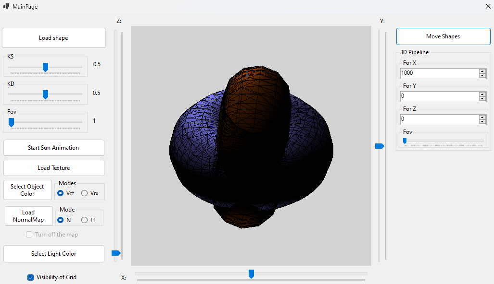

# GKLab2

This is my project made for the subject of computer graphics. It is an introduction project to D3 graphics. It implements Phong shading, basic 3D rendering pipeline and some other features.

Not all buttons work because the professor made changes in requirements during the last lab and this repository is a snapshot of the last state.

# Architecture

The project is an attempt of use model-view-presenter (VMP) architectural pattern and basic 3D rendering pipeline: model-view-projection.

# GUI - Windows Forms

